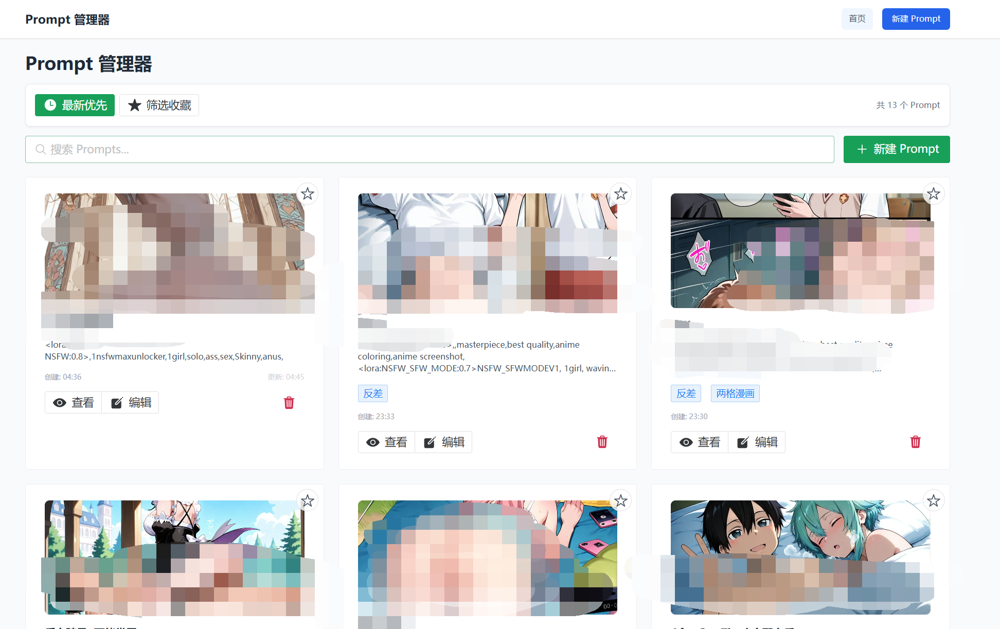

# Prompt Manager

一个功能强大的 AI Prompt 管理工具，基于 **Vue 3 + Nuxt 3 + TypeScript + SQLite** 构建，专为 AI 创作者和内容创作者设计。




## ✨ 核心特性

### 🎯 智能 Prompt 管理
- **完整的 CRUD 操作** - 创建、查看、编辑、删除 Prompt
- **多图片支持** - 每个 Prompt 可关联多张图片，支持拖拽上传
- **智能标签系统** - 自动推荐标签，支持多标签筛选
- **收藏功能** - 快速标记和访问重要 Prompt
- **高亮显示** - 支持 Prompt 内容的关键词高亮

### 🔍 强大的搜索与筛选
- **全文搜索** - 在标题、内容、标签中实时搜索
- **标签筛选** - 按单个或多个标签组合筛选
- **收藏筛选** - 快速查看收藏的 Prompt
- **智能排序** - 按创建时间正序/倒序排列
- **分类管理** - 手动创建与 Civitai 获取的内容分类显示

### 🌐 Civitai 深度集成
- **一键获取** - 通过 Civitai 模型链接直接获取 Prompt
- **模型信息解析** - 自动提取模型名称、描述、示例图片
- **Prompt 推荐** - 基于模型元数据推荐相关 Prompt
- **标签自动生成** - 从 Civitai 数据自动生成相关标签
- **浮窗工具** - 独立的 Civitai 获取工具窗口

### 📁 数据管理与备份
- **多格式导出** - 支持 JSON、Markdown、ZIP 格式导出
- **批量导入** - 支持从多种格式批量导入数据
- **数据备份** - 完整的数据库备份与恢复功能
- **图片管理** - 自动处理图片存储和路径管理
- **数据验证** - 导入时自动验证数据完整性

### 🎨 现代化用户体验
- **响应式设计** - 完美适配桌面和移动设备
- **暗色主题** - 支持明暗主题切换
- **拖拽操作** - 支持图片拖拽上传和窗口拖拽
- **实时预览** - 图片和内容的实时预览
- **快捷操作** - 丰富的键盘快捷键支持

## 🛠️ 技术架构

### 前端技术栈
| 技术 | 版本 | 用途 |
|------|------|------|
| Vue 3 | 3.5+ | 响应式前端框架 |
| Nuxt 3 | 4.0+ | 全栈框架，SSR/SSG |
| TypeScript | 5.9+ | 类型安全的 JavaScript |
| Naive UI | 2.42+ | 现代化 UI 组件库 |
| Tailwind CSS | 3.0+ | 原子化 CSS 框架 |
| Vite | 7.1+ | 快速构建工具 |

### 后端技术栈
| 技术 | 版本 | 用途 |
|------|------|------|
| Nitro | 内置 | 服务端运行时 |
| Prisma | 6.15+ | 现代化 ORM |
| SQLite | 3.0+ | 轻量级数据库 |
| Sharp | 0.33+ | 高性能图片处理 |
| Formidable | 3.5+ | 文件上传处理 |

### 核心功能模块
```
├── 🎯 Prompt 管理
│   ├── CRUD 操作
│   ├── 多图片支持
│   ├── 标签系统
│   └── 收藏功能
├── 🔍 搜索与筛选
│   ├── 全文搜索
│   ├── 标签筛选
│   └── 智能排序
├── 🌐 Civitai 集成
│   ├── 模型信息获取
│   ├── Prompt 提取
│   └── 自动标签生成
├── 📁 数据管理
│   ├── 导入导出
│   ├── 数据备份
│   └── 格式转换
└── 🎨 用户界面
    ├── 响应式设计
    ├── 主题切换
    └── 交互优化
```

## 🚀 快速开始

### 环境要求
- **Node.js** 18.0 或更高版本
- **npm** 或 **pnpm** 包管理器
- **现代浏览器** 支持 ES2020+

### 安装步骤

1. **克隆项目**
   ```bash
   git clone <repository-url>
   cd prompt-manager
   ```

2. **安装依赖**
   ```bash
   # 使用 npm
   npm install
   
   # 或使用 pnpm (推荐)
   pnpm install
   ```

3. **初始化数据库**
   ```bash
   # 生成 Prisma 客户端并创建数据库
   npm run dev
   ```
   首次运行会自动创建 SQLite 数据库文件并执行迁移。

4. **启动开发服务器**
   ```bash
   npm run dev
   ```
   应用将在 `http://localhost:3000` 启动。

### 可用脚本

| 命令 | 说明 |
|------|------|
| `npm run dev` | 启动开发服务器 (热重载) |
| `npm run build` | 构建生产版本 |
| `npm run preview` | 预览生产版本 |
| `npm run fix-db` | 修复数据库问题 |
| `npm run init-db` | 重新初始化数据库 |
| `npm run clear-cache` | 清理所有缓存 |
| `npm run dev-safe` | 安全模式启动 (修复数据库后启动) |
| `npm run dev-clean` | 清理模式启动 (清理缓存并重新初始化) |

## 📖 使用指南

### 基本操作

#### 创建 Prompt
1. 点击主界面的 **"新建 Prompt"** 按钮
2. 填写标题和内容
3. 可选择上传相关图片 (支持拖拽、粘贴、文件选择)
4. 添加标签 (系统会自动推荐)
5. 点击 **"创建"** 完成

#### 搜索与筛选
- **搜索**: 在搜索框输入关键词，支持标题、内容、标签搜索
- **标签筛选**: 点击标签筛选按钮，选择一个或多个标签
- **收藏筛选**: 点击收藏按钮只显示收藏的 Prompt
- **排序**: 点击排序按钮切换时间排序方式

#### 使用 Civitai 集成
1. 点击工具栏的 **"Civitai LORA"** 按钮
2. 在弹出窗口中粘贴 Civitai 模型链接
   ```
   示例: https://civitai.com/models/12345
   ```
3. 点击 **"获取信息"** 自动解析模型数据
4. 选择需要的 Prompt 并保存

### 数据管理

#### 导出数据
1. 点击工具栏的 **"导出"** 按钮
2. 选择导出格式:
   - **JSON**: 完整数据，支持重新导入
   - **Markdown**: 文档格式，便于阅读
   - **ZIP**: 包含图片的完整备份
3. 点击 **"确认导出"** 下载文件

#### 导入数据
1. 点击工具栏的 **"导入"** 按钮
2. 选择文件 (支持 .json, .md, .markdown, .zip)
3. 系统自动解析并导入数据
4. 查看导入统计报告

## 🗂️ 项目结构

```
prompt-manager/
├── 📁 app/                    # Nuxt 应用入口
│   ├── app.vue               # 根组件
│   └── lib/
│       └── prisma.ts         # Prisma 客户端配置
├── 📁 assets/                # 静态资源
│   └── css/
│       └── main.css          # 全局样式
├── 📁 components/            # Vue 组件
│   ├── CivitaiLora.vue      # Civitai 集成工具
│   ├── PromptCard.vue       # Prompt 卡片组件
│   ├── SmartImageUpload.vue # 智能图片上传
│   ├── SmartTagInput.vue    # 智能标签输入
│   └── TagFilter.vue        # 标签筛选器
├── 📁 composables/           # 组合式函数
│   ├── useCache.ts          # 缓存管理
│   └── useClipboardImage.ts # 剪贴板图片处理
├── 📁 layouts/               # 布局组件
│   └── default.vue          # 默认布局
├── 📁 pages/                 # 页面组件
│   ├── index.vue            # 主页
│   ├── create.vue           # 创建页面
│   ├── admin.vue            # 管理页面
│   └── edit/[id].vue        # 编辑页面
├── 📁 prisma/                # 数据库相关
│   ├── schema.prisma        # 数据库模式
│   ├── migrations/          # 数据库迁移
│   └── dev.db              # SQLite 数据库文件
├── 📁 server/api/            # API 路由
│   ├── prompts/             # Prompt 相关 API
│   ├── database/            # 数据库管理 API
│   ├── civitai/             # Civitai 集成 API
│   ├── upload/              # 文件上传 API
│   ├── import.post.ts       # 数据导入
│   └── export.get.ts        # 数据导出
├── 📁 types/                 # TypeScript 类型定义
│   ├── civitai.ts           # Civitai 相关类型
│   └── import-export.ts     # 导入导出类型
├── 📁 utils/                 # 工具函数
│   ├── civitai.ts           # Civitai 工具函数
│   └── tags.ts              # 标签处理工具
└── 📁 scripts/               # 脚本文件
    ├── init-database.js     # 数据库初始化
    ├── fix-database.js      # 数据库修复
    └── clear-all-cache.js   # 缓存清理
```

## 🔧 配置说明

### 环境变量
创建 `.env` 文件配置环境变量:
```env
# 数据库配置
DATABASE_URL="file:./prisma/dev.db"

# 应用配置
NUXT_PUBLIC_API_BASE="/api"
```

### 数据库配置
数据库模式定义在 `prisma/schema.prisma`:
```prisma
model Prompt {
  id          Int      @id @default(autoincrement())
  title       String   // Prompt 标题
  content     String   // Prompt 内容
  imagePath   String?  // 单图片路径 (向后兼容)
  images      String?  // 多图片路径 (JSON 格式)
  tags        String?  // 标签 (JSON 格式)
  highlights  String?  // 高亮信息 (JSON 格式)
  isFavorited Boolean  @default(false)
  createdAt   DateTime @default(now())
  updatedAt   DateTime @updatedAt
}
```

## 🚀 部署指南

### 生产环境部署

1. **构建应用**
   ```bash
   npm run build
   ```

2. **启动生产服务器**
   ```bash
   node .output/server/index.mjs
   ```

### Docker 部署
```dockerfile
FROM node:18-alpine
WORKDIR /app
COPY package*.json ./
RUN npm ci --only=production
COPY . .
RUN npm run build
EXPOSE 3000
CMD ["node", ".output/server/index.mjs"]
```

### 平台部署
- **Vercel**: 支持零配置部署
- **Netlify**: 支持静态生成部署
- **Railway**: 支持全栈应用部署
- **自托管**: 支持 Node.js 服务器部署

## 🤝 贡献指南

我们欢迎所有形式的贡献！

### 开发流程
1. Fork 项目
2. 创建功能分支 (`git checkout -b feature/AmazingFeature`)
3. 提交更改 (`git commit -m 'Add some AmazingFeature'`)
4. 推送到分支 (`git push origin feature/AmazingFeature`)
5. 创建 Pull Request

### 代码规范
- 使用 TypeScript 进行类型安全开发
- 遵循 Vue 3 Composition API 最佳实践
- 使用 ESLint 和 Prettier 保持代码风格一致
- 编写清晰的提交信息

## 📄 许可证

本项目采用 MIT 许可证 - 查看 [LICENSE](LICENSE) 文件了解详情。

## 🙏 致谢

- [Vue.js](https://vuejs.org/) - 渐进式 JavaScript 框架
- [Nuxt.js](https://nuxt.com/) - 直观的 Vue 框架
- [Naive UI](https://www.naiveui.com/) - Vue 3 组件库
- [Prisma](https://www.prisma.io/) - 下一代 ORM
- [Tailwind CSS](https://tailwindcss.com/) - 实用优先的 CSS 框架
- [Civitai](https://civitai.com/) - AI 模型分享平台

---

**如果这个项目对你有帮助，请给它一个 ⭐️！**
        
